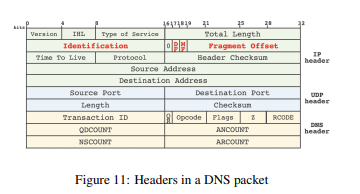

## Why DNS

1. People can't remember Internet Protocols
2. A domain is a text points to an IP or a collection of IPs.
3. Additional layer of abstraction is good.
4. IP can change while the domain remain.
5. We can serve the closest IP to a client requesting the same domain.
6. Load Balancing

# DNS

1. A new addressing system means a new mapping . Meet DNS.
2. If we have an IP and we need the MAC , we require ARP.
3. If you have the name and you need the IP, we require DNS.
4. Built on top of UDP
5. Port 53
6. Many records (MX , TXT , A , CNAME).

# HOW DNS Works

1. DNS resolver - frontend and cache
2. ROOT Server - Host IPs of TLDs
3. Top level domain server - Host IPs of the ANS
4. Authoritative Name Server - Hosts the IP of the target server.

``                                            ANS  
                                            TLD  
                                            ROOT  
                                          ``
 Server  laptop  Resolver  

# Questions for DNS:

1. why so many layers in DNS?  
Ans:The DNS (Domain Name System) uses a layered architecture to efficiently translate human-readable domain names into machine-readable IP addresses, and to manage the vast amount of data involved. This layered approach provides scalability, redundancy, and security. 
Here's why the layered structure is important:
Scalability:
The hierarchical structure allows the DNS to handle the billions of daily queries required to access websites and other online services. 
Redundancy:
Having multiple layers of servers (root, TLD, authoritative) ensures that if one server fails, others can still handle requests, preventing widespread outages. 
Efficiency:
By caching frequently accessed information closer to the user (recursive resolvers), DNS queries can be resolved quickly, improving browsing speeds. 
Security:
DNSSEC (DNS Security Extensions) and other security protocols are implemented at different layers to verify the authenticity of DNS information and protect against attacks like DNS spoofing. 
Organization:
The layered approach helps organize the vast amount of domain information, with each layer responsible for a specific part of the process (e.g., root servers know where to find TLD servers, TLD servers know where to find authoritative servers). 
Decentralization:
The distributed nature of DNS, with different organizations and individuals managing various parts of the system, prevents any single point of failure and ensures resilience

2. DNS is not encrypted by default.Explain.

Ans: DNS was designed in the 1980s when the internet was a smaller, more trusted network. The primary goals were speed and efficiency, not security. Consequently, it was built on the fast but unencrypted UDP protocol. The original designers did not prioritize encryption due to the perceived low-risk environment and the significant computational overhead it would have added at the time. This legacy design means that standard DNS queries are sent in plaintext, making them vulnerable to eavesdropping and manipulation by intermediaries like ISPs or attackers on the network. 

3. What is DNS hijacking/DNS Poisoning?

DNS Hijacking and DNS Poisoning are two critical security threats to the Domain Name System:

**DNS Poisoning** (also called DNS Cache Poisoning) occurs when malicious data is introduced into a DNS resolver's cache, causing it to return incorrect IP addresses for legitimate domain queries. The attacker exploits vulnerabilities in the DNS protocol to inject false records, making users visit fraudulent websites while believing they're accessing legitimate ones. This attack is particularly dangerous because:
- It affects all users relying on the poisoned DNS server
- The false information persists until the cache expires (TTL)
- It can be challenging to detect since everything appears normal to end users

**DNS Hijacking** involves redirecting DNS queries through various techniques:
1. **Router hijacking**: Compromising network devices to change their DNS settings
2. **Malware**: Installing software that modifies local DNS settings
3. **Rogue DNS servers**: Setting up fraudulent DNS servers
4. **Man-in-the-middle attacks**: Intercepting DNS traffic
5. **Compromised registrar accounts**: Taking over domain management accounts

Both attacks enable severe threats including credential theft, malware distribution, censorship, and surveillance. They're particularly dangerous because they can bypass HTTPS security by directing users to malicious sites while showing the correct domain in the address bar.

4. DoT/DoH attempts to address attacks against DNS.

Ans : DNS over TLS : 

DNS over TLS (DoT) and DNS over HTTPS (DoH) are security protocols designed to address the fundamental privacy and security issues in traditional DNS:

**DNS over TLS (DoT)**:
- Encrypts DNS queries using TLS (Transport Layer Security)
- Uses dedicated port 853
- Maintains the separate nature of DNS traffic
- Prevents eavesdropping and man-in-the-middle attacks
- Easier for network administrators to manage and monitor

**DNS over HTTPS (DoH)**:
- Encapsulates DNS queries within HTTPS traffic
- Uses standard HTTPS port 443
- Blends DNS traffic with regular web traffic, making it harder to block
- Provides similar security benefits as DoT
- More difficult for network administrators to monitor

These protocols address several key vulnerabilities:
1. **Privacy protection**: Encrypts DNS queries so ISPs and attackers can't see which websites users are visiting
2. **Prevention of DNS hijacking**: Makes it much harder for attackers to intercept and modify DNS queries
3. **Mitigation of DNS poisoning**: Helps verify the authenticity of DNS responses
4. **Bypass of DNS censorship**: Can help circumvent DNS-based censorship systems

Both technologies represent significant improvements in DNS security, though they come with trade-offs in terms of implementation complexity, performance overhead, and network management challenges.

